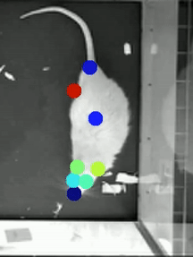

# Markerless Pose and Behavior Prediction for Rat Models

Here we have provided an open source software pipeline to estimate animal pose and detect a limited set of animal behaviors that are important for biomedical animal studies which include locomotion analysis, prevelence of Rearing, and prevelence of stereotopic behavior.

This project was done by Gouthamrajan Nadarajan, Dowlette Alam El Din, and Zachary Smith and was supervised by [Dr. Anirban Dutta](http://medicine.buffalo.edu/faculty/profile.html?ubit=anirband) and was optimized for animal models from [Dr. Jinwoo Park's](http://medicine.buffalo.edu/faculty/profile.html?ubit=jinwoopa) lab.

